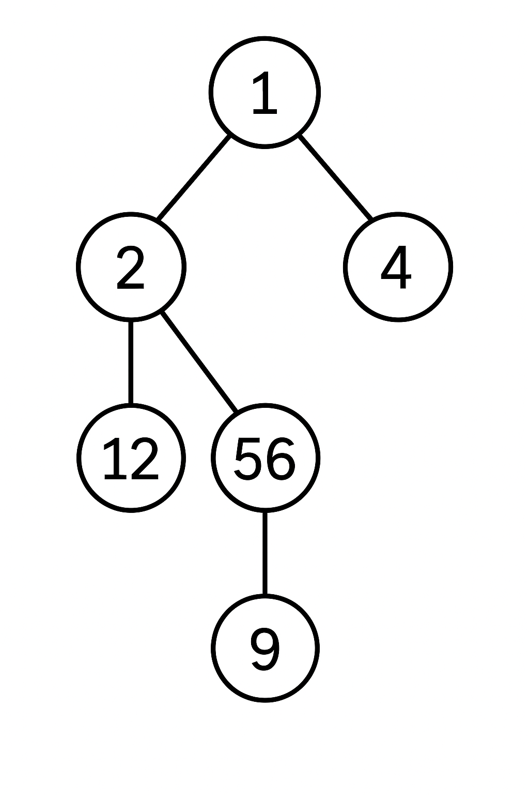

# Social Connection Service – Node.js + Express + Prisma

This backend service allows users to connect with each other — similar to friend connections on social platforms.  
Built with **Node.js**, **Express**, and **Prisma ORM**.

---

## Features

- Create and manage user accounts
- Connect or disconnect users
- Retrieve **N-level connections** (friends of friends, etc.)
- Prevent circular or duplicate connections
- Get all users
- Get user by ID
- Delete user by ID

---

## 1. Database Design

### **Model: `User`**

**Fields Description:**

- **id** → Unique identifier primary key
- **name** → User’s full name
- **email** → Unique email address
- **connections** → A **JSON object** storing connected user IDs
- **createdAt** → Timestamp of creation
- **updatedAt** → Timestamp of update

---

## 2. API Endpoints

| Method     | Endpoint                        | Description               |
| ---------- | ------------------------------- | ------------------------- |
| **POST**   | `/users`                        | Create a new user         |
| **GET**    | `/users`                        | Get all users             |
| **GET**    | `/users/:id`                    | Get user by ID            |
| **DELETE** | `/users/:id`                    | Delete user by ID         |
| **POST**   | `/connect`                      | Connect two users         |
| **POST**   | `/disconnect`                   | Disconnect two users      |
| **GET**    | `/users/:id/connections/:level` | Fetch N-level connections |

---

## 3. API Details

### **a. Create User**

**Endpoint:**  
`POST /users`

**Request Body:**

```json
{
  "name": "John Doe",
  "email": "john@example.com"
}
```

**Response:**

```json
{
  "data": {
    "id": 1,
    "name": "abc",
    "email": "katiyar@gmail.com",
    "connections": []
  }
}
```

---

### **b. Get All Users**

**Endpoint:**  
`GET /users`

**Response:**

```json
{
  "data": [
    {
      "id": 1,
      "name": "abc",
      "email": "katiyar@gmail.com",
      "connections": []
    },
    {
      "id": 5,
      "name": "pqr",
      "email": "gautams@gmail.com",
      "connections": []
    }
  ]
}
```

---

### **c. Get User by ID**

**Endpoint:**  
`GET /users/:id`

**Example Response:**

```json
{
  "data": {
    "id": 3,
    "name": "abc",
    "email": "gautam@gmail.com",
    "connections": []
  }
}
```

---

### **d. Delete User by ID**

**Endpoint:**  
`DELETE /users/:id`

**Response:**

```json
{
  "data": {
    "id": 3,
    "name": "abc",
    "email": "gautam@gmail.com",
    "connections": []
  }
}
```

---

### **e. Connect Users**

**Endpoint:**  
`POST /connect`

**Request Body:**

```json
{
  "userId1": "1",
  "userId2": "5"
}
```

before

```json
{
  "data": [
    {
      "id": 1,
      "name": "abc",
      "email": "katiyar@gmail.com",
      "connections": []
    },
    {
      "id": 5,
      "name": "pqr",
      "email": "gautams@gmail.com",
      "connections": []
    }
  ]
}
```

after

```json
{
  "data": {
    "user1": {
      "id": 1,
      "name": "abc",
      "email": "katiyar@gmail.com",
      "connections": [5]
    },
    "user2": {
      "id": 5,
      "name": "pqr",
      "email": "gautams@gmail.com",
      "connections": [1]
    }
  }
}
```

**Response:**

```json
{
  "data": {
    "user1": {
      "id": 1,
      "name": "abc",
      "email": "katiyar@gmail.com",
      "connections": [5]
    },
    "user2": {
      "id": 5,
      "name": "pqr",
      "email": "gautams@gmail.com",
      "connections": [1]
    }
  }
}
```

---

### **f. Disconnect Users**

**Endpoint:**  
`POST /disconnect`

**Request Body:**

```json
{
  "userId1": "uuid-1",
  "userId2": "uuid-2"
}
```

before

```json
{
  "data": {
    "user1": {
      "id": 1,
      "name": "abc",
      "email": "katiyar@gmail.com",
      "connections": [5]
    },
    "user2": {
      "id": 5,
      "name": "pqr",
      "email": "gautams@gmail.com",
      "connections": [1]
    }
  }
}
```

after

```json
{
  "data": {
    "user1": {
      "id": 1,
      "name": "abc",
      "email": "katiyar@gmail.com",
      "connections": []
    },
    "user2": {
      "id": 5,
      "name": "pqr",
      "email": "gautams@gmail.com",
      "connections": []
    }
  }
}
```

**Response:**

```json
{
  "message": "User Disconnected"
}
```

---

### **g. Get N-Level Connections**

#### Endpoint

```
GET /users/:id/connections/:level
```

---

### What Are N-Level Connections?

In a social graph:

- Every user = a node

N-level means:

- Level 1 → Immediate Friends
- Level 2 → Immediate Friends of Level 1
- Level 3 → Immediate Friends of Level 2

Consider the following connections:



### Example Query

`GET /users/56/connections/2`

**Example Response:**

```json
{
  "data": [
    {
      "id": "56",
      "name": "",
      "email": "",
      "connections": [2, 9]
    },
    {
      "id": "2",
      "name": "",
      "email": "",
      "connections": [12, 56, 1]
    },
    {
      "id": "9",
      "name": "",
      "email": "",
      "connections": [56]
    },
    {
      "id": "12",
      "name": "",
      "email": "",
      "connections": [2]
    },
    ,
    {
      "id": "1",
      "name": "",
      "email": "",
      "connections": [2, 4]
    }
  ]
}
```

only 2 level connections has been asked for, so
id 56, has 2,9 as immediate friends,
2 has 12,1 as as immediate friends

---
