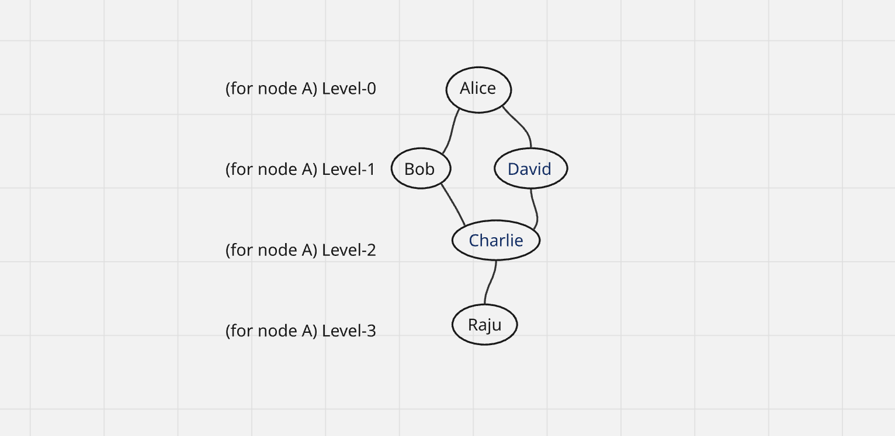

# Social Connection Service – Node.js + Express + Prisma

This backend service allows users to connect with each other — similar to friend connections on social platforms.  
Built with **Node.js**, **Express**, and **Prisma ORM**.

---

## Features

- Create and manage user accounts  
- Connect or disconnect users  
- Retrieve **N-level connections** (friends of friends, etc.)  
- Prevent circular or duplicate connections  
- Get all users  
- Get user by ID  
- Delete user by ID  

---

## 1. Database Design 

### **Model: `User`**

**Fields Description:**
- **id** → Unique identifier primary key  
- **name** → User’s full name  
- **email** → Unique email address  
- **connections** → A **JSON object** storing connected user IDs  
- **createdAt** → Timestamp of creation  
- **updatedAt** → Timestamp of update  

---

## 2. API Endpoints

| Method | Endpoint | Description |
|--------|----------|-------------|
| **POST** | `/users` | Create a new user |
| **GET** | `/users` | Get all users |
| **GET** | `/users/:id` | Get user by ID |
| **DELETE** | `/users/:id` | Delete user by ID |
| **POST** | `/connect` | Connect two users |
| **POST** | `/disconnect` | Disconnect two users |
| **GET** | `/users/:id/connections/:level` | Fetch N-level connections |

---

## 3. API Details

### **a. Create User**

**Endpoint:**  
`POST /users`

**Request Body:**
```json
{
  "name": "John Doe",
  "email": "john@example.com"
}
```

**Response:**
```json
{
  "message": "User created successfully",
  "user": {
    "id": "uuid",
    "name": "John Doe",
    "email": "john@example.com",
    "connections": {},
    "createdAt": "timestamp",
    "updatedAt": "timestamp"
  }
}
```

---

### **b. Get All Users**

**Endpoint:**  
`GET /users`

**Response:**
```json
{
  "users": [
    {
      "id": "uuid",
      "name": "John Doe",
      "email": "john@example.com"
    }
  ]
}
```

---

### **c. Get User by ID**

**Endpoint:**  
`GET /users/:id`

**Example Response:**
```json
{
  "id": "uuid",
  "name": "John Doe",
  "email": "john@example.com",
  "connections": {}
}
```

---

### **d. Delete User by ID**

**Endpoint:**  
`DELETE /users/:id`

**Response:**
```json
{
  "message": "User deleted successfully"
}
```

---

### **e. Connect Users**

**Endpoint:**  
`POST /connect`

**Request Body:**
```json
{
  "userId1": "uuid-1",
  "userId2": "uuid-2"
}
```

**Response:**
```json
{
  "message": "User Connected"
}
```

---

### **f. Disconnect Users**

**Endpoint:**  
`POST /disconnect`

**Request Body:**
```json
{
  "userId1": "uuid-1",
  "userId2": "uuid-2"
}
```
**Response:**
```json
{
  "message": "User Disconnected"
}
```

---

### **g. Get N-Level Connections**

#### Endpoint
```
GET /users/:id/connections/:level
```

---

### What Are N-Level Connections?

In a social graph:
- Every user = a node
- Every connection = an edge

N-level means:
- Level 1 → Direct Connections (Immediate Friends) 
- Level 2 → Friends of Level 1 Connections (Friends of Friends)
- Level 3 → Friends of Level 2 Connections (Extended Network)  

### Users to Create

Create the following users:

- A
- Bob
- Alice
- David
- Charlie
- Raju

---

### Connections (According to the Graph)

Create the following connections:

- A → Bob  
- A → David  
- Bob → Alice  
- Bob → Charlie  
- David → Charlie  
- Charlie → Raju  

---

### ***Graph Levels***


### Example Query

`GET /users/1/connections/2`

**Example Response:**
```json
{
  "userId": "1",
  "level": 2,
  "connections": [
    { "id": "2", "name": "Alice" },
    { "id": "3", "name": "Bob" },
    { "id": "4", "name": "Charlie" },
    { "id": "5", "name": "David" }
  ]
}
```

---

